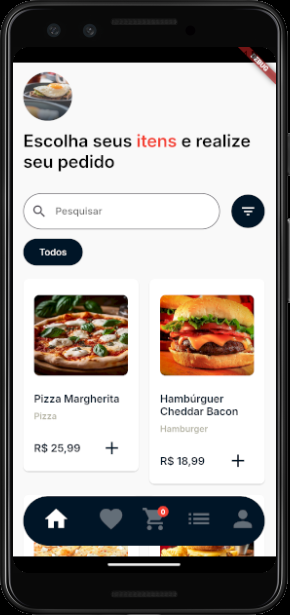
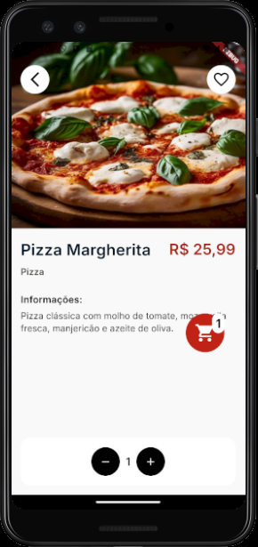
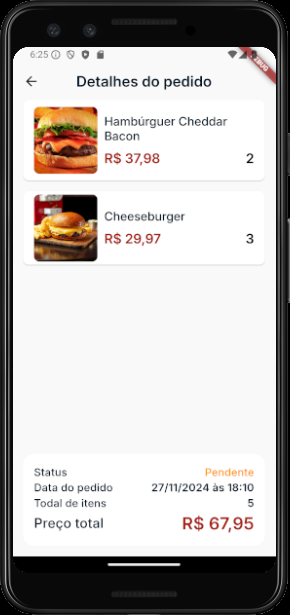
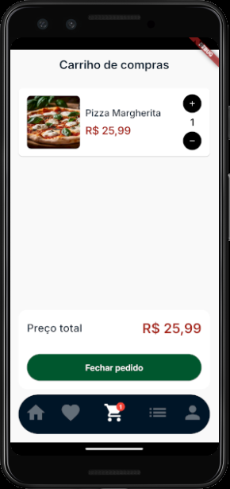

<h1 align="center">
  
</h1>

## 💻 Projeto

Está aplicação foi criada para estudos em flutter.<br>
Sendo que esta aplicação é a parte mobile de um projeto em microsserviço de pedidos.<br>
O back desta aplicação pode ser encontrado no link a seguir: <br> [Link do back](https://github.com/WillianMedeiros14/comex-microservices-dotnet).
<br>

## ⓘ Informações

- Está aplicação tem como objetivo a realização de pedidos de refeições.
  <br><br>

## 💡 Design
O Design no figma pode ser encontrado no link abaixo: <br> 
[Design no figma](https://www.figma.com/design/brfDB7kcfjH5jtIBgOok6v/Untitled?node-id=0-1&node-type=canvas&t=FoaDct9UQD0vOn2c-0). <br><br>

## ✅ Funcionalidades existentes

- Visualizar produtos
- Filtrar produtos por categoria
- Visualizar detalhes de um produto
- Adicionar itens ao carinho
- Remover itens do carinho
- Visualizar carinho
- Realizar pedido
- Visualizar pedidos realizados
- Visualizar detalhes de um pedido realizado

<br>

## ✅ Resultado do projeto

<h1 align="center">
  
  
  
  
</h1>

Você pode assistir ao vídeo do resultado do projeto [aqui](https://drive.google.com/file/d/10ICf_y-h25923oUzuZcc9ry8PFJ-lbq1/view?usp=sharing).

<br>

## 🎲 Executar
### Ambiente
- Certifique-se de que tenha o flutter configurado em sua mpáquina;
- A versão utilizada nesse projeto é a 3.22.2

####  Back
Para essa aplicação funcionar, o back precisa estar executando, para ter acesso ao back e executar, acesse o link abaixo:

[Link do back](https://github.com/WillianMedeiros14/comex-microservices-dotnet)

### Projeto
1. Clone o repositório e entre na pasta:

   ```bash
   git clone https://github.com/WillianMedeiros14/comex_app.git
   cd comex_app
   ```

2. Baixe as dependências:

   ```bash
   flutter pub get
   ```


3. Altere o ip da baseUrl:
- Como a api vai estar sendo executada localmente, você precisa alterar o ip na baseUrl. 
   ```bash
   # depois de pegar o ip da sua máquina na rede, altere no arquivo abaixo.
   # o arquivo fica em 'comex_app\lib\shared\data\http\http_client.dart'

   final String baseUrl = 'http://192.168.51.106:8082/api';
   ```
4. Execute a aplicação:
- Depois de ter realizado os passos anteriores, pode rodar normalmente o aplicativo. 

<br>

## 🚀 Principais recursos e tecnologias ultilizadas
- **[Flutter](https://flutter.dev/)**.
- **[MobX](https://mobx.netlify.app/)**.
- **[Package http](https://pub.dev/packages/http)**.
